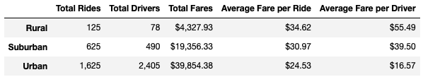
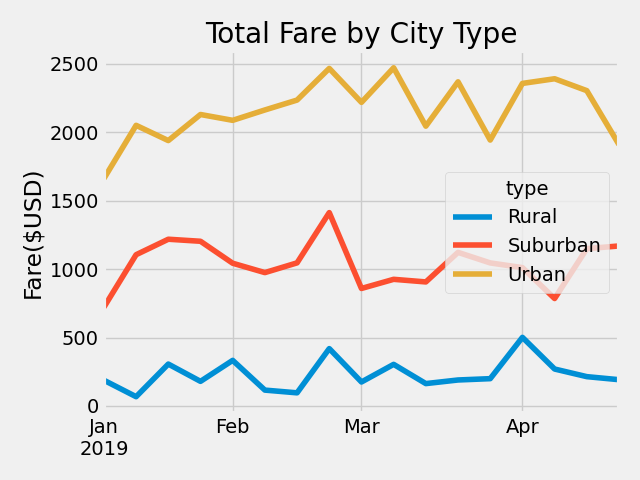

# PyBer Analysis
## Description
An analysis and summary of data from the ficticious ride-share company, PyBer, from 1/1/2019 to 5/8/2019. This analysis examines the number of rides, the number of drivers, and the total fares across three types of cities: urban, suburban, and rural. 

### Resources
Analysis and Data Soures:

- [Jupyter Notebook Analysis](PyBer_Challenge.ipynb)
- [ride_data.csv](resources/ride_data.csv)
- [city_data.csv](resources/city_data.csv)

Software and Tools:
- Python 3.7.13
- Pandas 1.3.5
- MatPlotLib 3.5.2
- Jupyter Notebook 6.4.12

## Analysis and Findings
### Summary Findings
We see a general trend across the type of city of fewer total rides, total drivers and total fares in rural cities, to the greatest number of total rides, total drivers, and total fares in urban cities (with suburban numbers falling between the two). The following figure shows this trend.

### Total Rides, Drivers and Fares
In rural and suburban cities we see that the total number of drivers is less than the total number of rides. So there exists a driver or drivers who are taking more than one ride. Contrast this with urban cities: there are more total drivers than total rides, so some drivers, although registered are not taking any rides.

### Average Fare per Ride and per Driver
While above we see the trend of an increase from rural to suburban to urban cities in total rides, total drivers, and total fares, we a decreasing trend in the average fare per ride and average fare per driver. It is reasonable to infer that the reason for the decrease in average fare per ride is due to assumed shorter ride distances in urban cities compared to suburban and rural cities. However further data and analyses would be necessary to confirm this inference. It is no surprise however that we see the Average fare per driver fall below the average fare per ride in urban cities: in urban cities there are more total drivers than there are total rides. So even if we saw an increase in average fare per ride in urban cities, we would still expect an average fare per driver below the average fare per ride.

### Total Fare by City Type
As discussed above we see the total fares increase from rural to suburban to urban cities. The following figure shows these findings from January 1, to April 28 of 2019.

While our data does not allow us an interpretation for the week-to-week fluctuation in fares, we might guess that the overall increase in fares from the first week of January and into March is due to Winter weather. Urban residents are less likely to own a car than suburban or rural residents, so we might expect an increase due to urban residents avoiding walking in the colder weather. We see this increase appear to drop of at the end of April, with dips in March. Again, we would need further data and analyses to confirm this intuition.

### Business Recommendations

1. Given that there are more drivers than there are rides in urban cities, we can infer that not all drivers are taking rides. But PyBer has the capacity for far more total rides. Therefore, a marketing campaign is recommended for urban cities in an attempt to at least fill the capacity allowed by the number of drivers.

2. Due to similar reasoning in (1), PyBer can decrease efforts in recruiting more drivers for urban cities. There are some drivers that are not taking any rides, therefore there is no present need to increase the number of drivers. The recruitment of drivers should not cease in its entirety, as regular turnover should continue to be expected. It may be justifiable to increase driver recruitment again if the proposed marketing campaign in (1) proves effective, and there a need for an increased ride capacity.

3. Rural cities amount to less than 7% of fares across all city types. Therefore, PyBer should consider no longer allocating a great deal of funding in recruitment or advertising of the PyBer service in rural cities. PyBer should still service rural cities, but consider them an auxillary source of revenue compared to the primary urban and suburban sources.